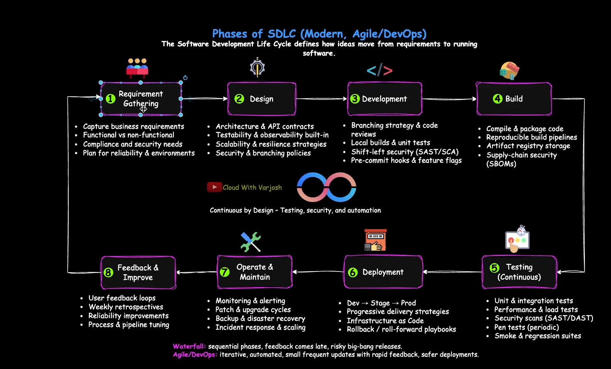

### Day 1: Modern SDLC Explained | Build Automation & Real-World Insights

- Agenda:
  - Phases of SDLC
  - Waterfall vs Agile
  - Compiled vs Interpreted languages
  - What are Artifacts, Runtimes, Dependencies
  - Build Process for Containerized and Non-Containerized Workloads

Phases of SDLC (Modern, Agile/DevOps)

- The Software Development Life Cycle defines how ideas move from requirements to running software
  
