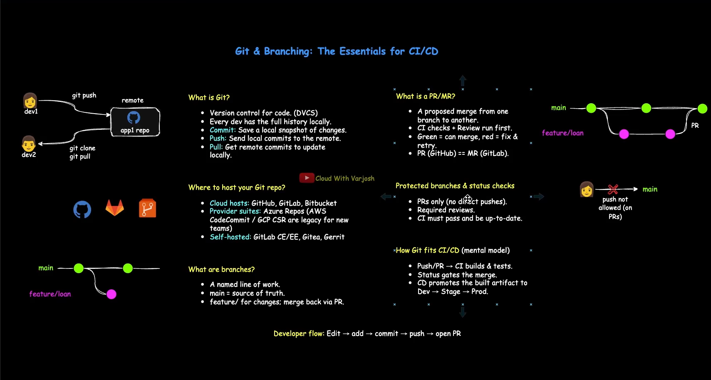
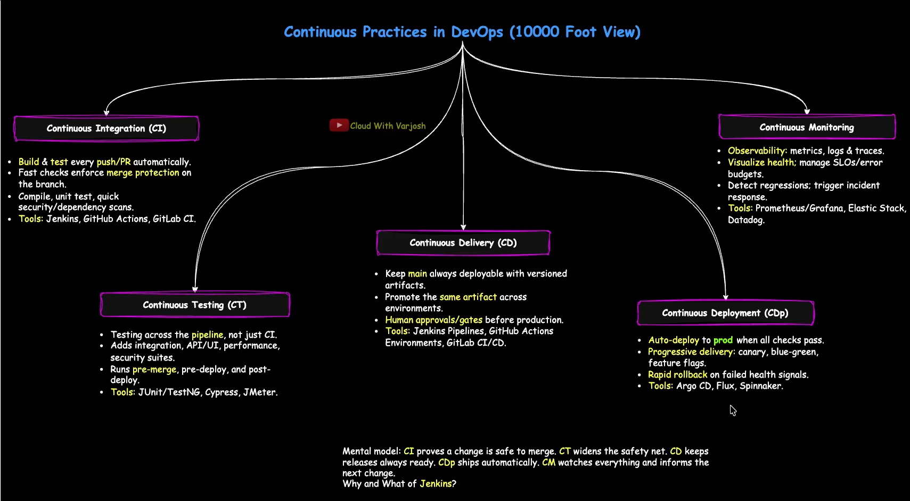
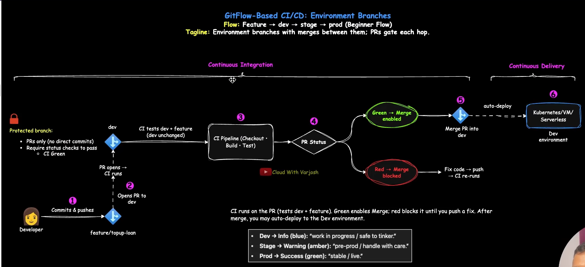

# CI-CD

## Git & Branching : THe Essential for CI/CD

PR -> Pull Request
MR -> Marge Request

- Developer flow : Edit -> Add -> Commit -> Push -> Open PR

## Continuous Practices in DevOps (10000 Foot View)

- CI, CT, CD, CDP, CM

- **Continuous Integration**
  - Build & Test every push/PR automatically
  - Fast checks enforce merge protection on the branch
  - Compile, uit test, quick, Security/dependency scans.
  - Tools: Jenkins, Github Actions, GitLab CL
  - What happen Your git repository and what ever happen your building stage it is called Continuous Integration.

- **Continuous Testing (CT)**
  - Testing across the pipeline, not just CI.
  - Adds integration, Api/UI, Performance, security suites.
  - Runs pre-merge, pre-deploy and post-deploy
  - Tools: JUnit/Testing, Cypress, JMeter.
  - SAST ( Static Application Security Testing) scans source code or binaries before build/deploy, catching security flaws early in CI.
  - DAST (Dynamic Application Security Testing) tests the running application post-deployment, simulating real attacks at runtime.

- **Continuous Delivery (CD)**
  - Keep main always deployable with versioned artifact.
  - Promote the same artifact across environment
  - Human approvals/gates before production.
  - Tools: Jenkins Pipeline, Github Actions Environments, GitLab CI/CD
  - **Continuous Delivery(CD)** = Ready, But Approval needed
  - **Continuous Deployment(CDP)** = Straight to prod, no Approval

- **Continuous Deployment(CDP)**
  - Auto-deploy to prod when all checks pass
  - Progressive delivery : canary, blue-green, feature flags.
  - Tools: Agro CD, Flux,

- **Continuous Monitoring**
  - Observability: Metrics, logs & traces.
  - Visualize Health : manage SLOs/error budgets.
  - Detect regressions: trigger incident response
  - Tool: Prometheus/Grafana, Elastic Stack, Datalog.

- Continuous Delivery is anything that require manual approval before deploying

---

## GitFlow-Based CI/CD: Environment Branches

