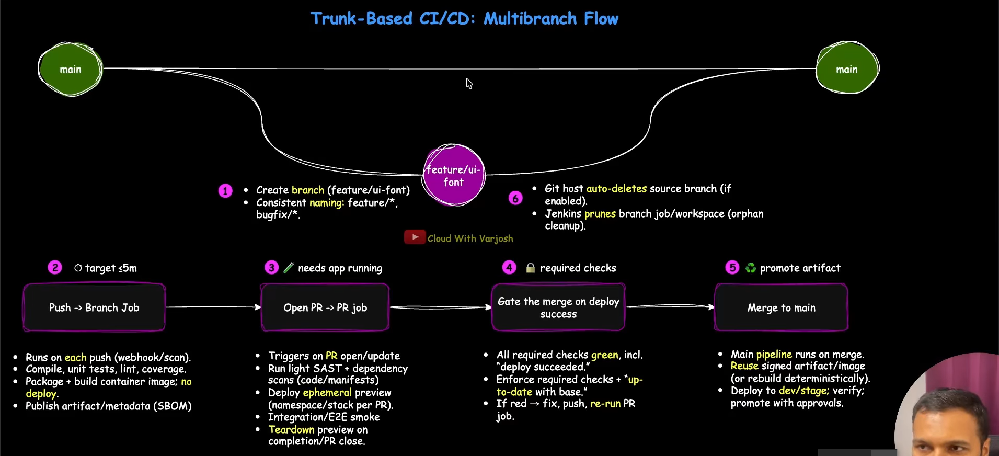

## Day 7 : Jenkins Multi branch Pipelines | CI/CD with GitHub PRs & Docker Deploy

- Agenda :
  - What & Why of Multi branch Pipelines
  - Trunk-Based CI/CD : Multi branch Flow
  - Demo : Jenkins Multi-Branch Pipeline

- SCM = Sources Code Management

- Multi-Branch Pipelines :
  - It is a jenkins job type that scans your SCM and automatically creates a child pipeline for every branch/PR/tag .
  - Repository-driven CI mirrors branching model; auto-creates jobs per-branch.
  - Jenkinsfile-first build only refs containing Jenkinsfile per branch/pr
  - Fast feedback: pushes and pr updates trigger CI
  - Lifecycle automation via webhooks creates and retires jobs
  - Lower blast radius : isolate builds; keep main clean.
  - scales with teams ; auto-discovers and prunes short-lived branches.

- In trunk-based CI/CD, MBP(Multi Branch Pipeline) is the glue: feature/bugfix branches stay small, PRs get tested automatically and main stays releasable.

## Trunk-Based CI/CD : MultiBranch Flow

